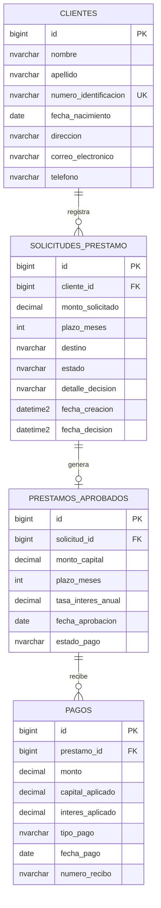

# Diagrama Entidad/Relacion

```mermaid
erDiagram
    CLIENTES ||--o{ SOLICITUDES_PRESTAMO : registra
    SOLICITUDES_PRESTAMO ||--o| PRESTAMOS_APROBADOS : genera
    PRESTAMOS_APROBADOS ||--o{ PAGOS : recibe

    CLIENTES {
        bigint id PK
        nvarchar nombre
        nvarchar apellido
        nvarchar numero_identificacion UK
        date fecha_nacimiento
        nvarchar direccion
        nvarchar correo_electronico
        nvarchar telefono
    }

    SOLICITUDES_PRESTAMO {
        bigint id PK
        bigint cliente_id FK
        decimal monto_solicitado
        int plazo_meses
        nvarchar destino
        nvarchar estado
        nvarchar detalle_decision
        datetime2 fecha_creacion
        datetime2 fecha_decision
    }

    PRESTAMOS_APROBADOS {
        bigint id PK
        bigint solicitud_id FK
        decimal monto_capital
        int plazo_meses
        decimal tasa_interes_anual
        date fecha_aprobacion
        nvarchar estado_pago
    }

    PAGOS {
        bigint id PK
        bigint prestamo_id FK
        decimal monto
        decimal capital_aplicado
        decimal interes_aplicado
        nvarchar tipo_pago
        date fecha_pago
        nvarchar numero_recibo
    }
```
